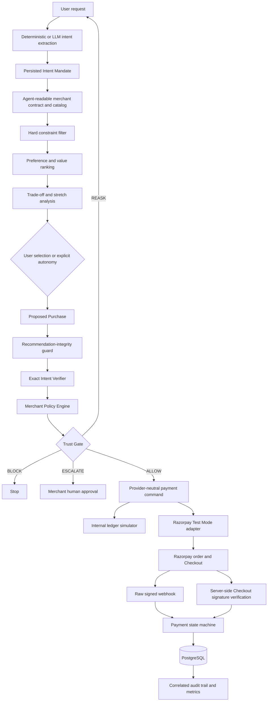
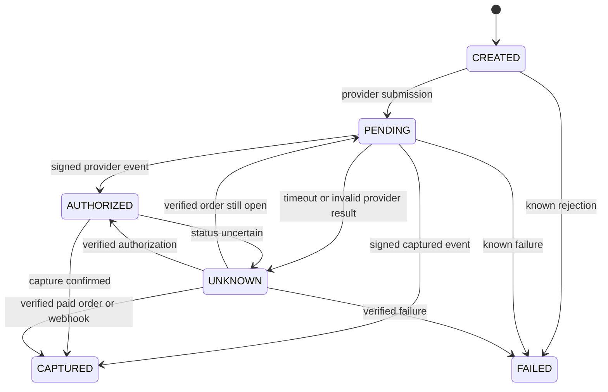

# IntentPay Architecture

## Trust and execution flow



The LLM-facing component ends at structured intent extraction. It cannot call a
provider directly. Only deterministic code behind the Trust Gate can construct
a provider command.

## Payment state and uncertainty



An `UNKNOWN` payment is never automatically retried. IntentPay fetches the
known provider order or searches by its deterministic receipt, then verifies
order ID, amount, currency, and receipt before reconciliation.

## Persisted financial evidence

```text
IntentDB
  intent_id, correlation_id, protocol_version, mandate, selected_product_id

PaymentDB
  payment_id, intent_id, product_id, amount, currency, idempotency_key
  provider, provider_order_id, provider_payment_id, provider_status, status

WebhookEventDB
  event_id, payment_id, provider, signature_verified, status, processed

AuditLogDB
  audit_id, component, decision, reason_code, amount, details, created_at
```

Secrets and signatures are not stored in audit details. Correlation IDs connect
intent, Trust Gate, payment, provider, webhook, and reconciliation evidence.

